<div align="center">



<br>

[](https://git.io/typing-svg)

[](https://www.linkedin.com/in/shashwat-balodhi-629594250/)
[](mailto:shashwatbalodhi20032@gmail.com)
[](https://github.com/Shashwat-Balodhi)

</div>


## `[ 0x01 ]` ABOUT_ME

```python
class AIEngineer:
    def __init__(self):
        self.name = "Shashwat Balodhi"
        self.role = "AI/ML Engineer"
        self.education = "M.Tech AI @ VIT Bhopal (8.71 CGPA)"
        self.location = "Bhopal, India 🇮🇳"

        self.expertise = {
            "LLMs": ["Fine-tuning (LoRA/QLoRA)", "RAG Systems", "Evaluation"],
            "ML/DL": ["PyTorch", "Transformers", "NLP", "Computer Vision"],
            "Deployment": ["Docker", "Flask APIs", "CI/CD", "MLOps"],
            "Automation": ["LLM Agents", "Browser Automation", "OCR Pipelines"]
        }

        self.current_mission = "Building AI systems that solve real-world problems"

    def say_hi(self):
        return "Thanks for visiting! Let's build the future with AI 🚀"

me = AIEngineer()
print(me.say_hi())
```


## `[ 0x02 ]` WHAT_I'M_BUILDING

<div align="center">

| 🎯 FOCUS_AREA | 🛠️ TECHNOLOGIES | 💡 IMPACT |
|:---|:---|:---|
| **LLM Engineering** | RAG, Fine-tuning, Unsloth | Production-ready AI systems |
| **Document Intelligence** | OCR, NLP, Transformers | 90%+ accuracy, 60% time savings |
| **Intelligent Automation** | Browser Agents, LLM Orchestration | 80% reduction in manual effort |
| **Production ML** | Docker, Jenkins, Arize AI | Scalable, monitored deployments |

</div>


## `[ 0x03 ]` TECH_ARSENAL

<div align="center">

**AI & MACHINE LEARNING**


**LLMs & GENAI**


**DEVOPS & DEPLOYMENT**


**FULL STACK (PoCs)**


</div>


## `[ 0x04 ]` FEATURED_PROJECTS

<div align="center">

| PROJECT | DESCRIPTION | TECH_STACK | IMPACT |
|:---|:---|:---|:---|
| 🎯 **[Virgo's Whisper AI](https://github.com/Shashwat-Balodhi/Virgo-s-Whisper-AI)** | Real-time AI co-pilot for first responders with <2s latency | LLMs, STT/TTS, Multi-agent | 🏆 Hackathon Winner |
| ⚖️ **[AIPR](https://github.com/Shashwat-Balodhi/AIPR_Frontend)** | Legal document proofreader with OCR pipeline | Transformers, OCR, NLP | 90%+ accuracy, 60% time saved |
| 🌐 **[HMM Tracker](https://github.com/Shashwat-Balodhi/assignment-without-webui)** | LLM-driven logistics automation system | BrowserUse, LLM Agents | 80% effort reduction |

</div>

<details>
<summary><b>🎯 VIRGO'S_WHISPER_AI — Crisis Response Co-Pilot</b></summary>
<br>

**THE_CHALLENGE:** First responders face cognitive overload during emergencies.

**THE_SOLUTION:** Real-time AI assistant with multi-modal capabilities
- 🗣️ Voice interaction with speech-to-text/text-to-speech
- 🧠 LLM-powered reasoning and decision support
- 💾 Persistent memory across multi-turn conversations
- ⚡ Sub-2-second end-to-end latency

**TECH:** LLMs, Real-time inference, Multi-service architecture, Voice synthesis

**ACHIEVEMENT:** 🏆 Winner - Innovative Minds Hackathon 2025
</details>

<details>
<summary><b>⚖️ AIPR — AI Legal Document Proofreader</b></summary>
<br>

**THE_PROBLEM:** Manual legal document review is time-consuming and error-prone.

**THE_INNOVATION:** NLP-powered automated proofreading system
- 📄 Processes 100+ page documents with OCR pipeline
- 🎯 90%+ accuracy in error detection
- ⚡ 60% reduction in manual review time
- 🔍 Handles both digital and scanned documents

**TECH:** Transformers, Chunkr OCR, Document Processing, NLP

**STATUS:** In active development (Feb 2025 - Present)
</details>

<details>
<summary><b>🌐 HMM_BOOKING_INFO_TRACKER — Intelligent Automation</b></summary>
<br>

**THE_NEED:** Manual tracking of dynamic logistics data is inefficient.

**THE_APPROACH:** LLM-driven browser automation
- 🤖 Autonomous web navigation and data extraction
- 🔄 Handles dynamic interfaces automatically
- 📊 80% reduction in manual tracking effort
- 🎯 Recurring query optimization

**TECH:** BrowserUse, LLM Automation, Web Scraping
</details>


## `[ 0x05 ]` PROFESSIONAL_JOURNEY

### `>` FREELANCE WEB & BACKEND DEVELOPER
*2026 – Present*

- Built 2+ production applications with Next.js & React
- Optimized backend APIs (Supabase) → **30% performance boost**
- Automated CI/CD pipelines → **70% reduction in deployment time**

### `>` DEVELOPER_INTERN @ MPEB
*Oct 2025 – Dec 2025*

- Developed enterprise-scale backend APIs with SQL stored procedures
- Processed large organizational datasets
- Collaborated with stakeholders on technical solutions

### `>` PROJECT_INTERN @ PERSONIFWY
*Jun 2023 – Sep 2023*

- Trained ML models for text/image classification
- Improved performance through systematic experimentation


## `[ 0x06 ]` GITHUB_ANALYTICS

<div align="center">


<br/>


<br/>


</div>


## `[ 0x07 ]` ACHIEVEMENTS_&_RECOGNITION

<div align="center">

| 🏅 ACHIEVEMENT | 🎯 EVENT | 📅 YEAR |
|:---|:---|:---:|
| 🥇 **Winner** | Innovative Minds | 2025 |
| 🥇 **Winner** | Synovate: Tech for Tots | 2025 |
| 🎯 **Finalist** | Innovation Challenge | 2025 |
| 🎯 **Finalist** | Inya.ai Hackathon | 2025 |
| 📝 **Finalist** | Vision for Viksit Bharat (Research) | 2025 |

</div>


## `[ 0x08 ]` EDUCATION

<div align="center">

**VIT BHOPAL UNIVERSITY**
Integrated M.Tech in Artificial Intelligence
📅 Sep 2022 – May 2027 &nbsp;|&nbsp; 🎯 CGPA: 8.71/10.0

</div>


## `[ 0x09 ]` CURRENT_FOCUS

```yaml
currently_learning:
  - Advanced RAG architectures
  - Multi-agent systems
  - LLM evaluation frameworks
  - Production ML optimization

open_to:
  - AI/ML collaborations
  - Research opportunities
  - Open source contributions
  - Interesting conversations about AI

fun_fact: "I turn coffee into LLM-powered systems ☕ → 🤖"
```


## `[ 0x0A ]` CONNECT

<div align="center">

[](mailto:shashwatbalodhi20032@gmail.com)
[](https://www.linkedin.com/in/shashwat-balodhi-629594250/)
[](https://github.com/Shashwat-Balodhi)


### `//` "The best way to predict the future is to build it with AI."


</div>
